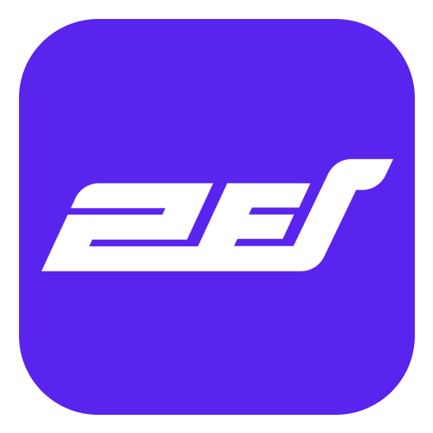

# 랜딩 페이지

[루틴업 - 31조](https://kookmin-sw.github.io/capstone-2024-31/)
<br />

# 성장을 위한 좋은 습관, 루틴업



건강한 생활 습관을 만들고 싶다면, <br />
도파민에서 멀어지고 싶다면, <br />
다른 사람들과 함께 성장하고 싶다면, <br />
루틴업을 이용해보세요.
<br />

## 📘 주요 기능 | Key Features

### 챌린지를 통한 습관 형성

자신만의 챌린지를 만들어 좋은 습관을 만들어 나갈 수 있습니다.

### 손가락 모양을 통한 실시간 인증

실시간 보장을 통해 신뢰도를 높이고, 더욱 효과적인 습관 형성을 도와줍니다.

### 커뮤니티 기반 공동체 성장

커뮤니티를 통해 다른 사람들과 함께 성장하고, 서로의 성공을 응원할 수 있습니다.

### 성공시 포인트 제공

달콤한 보상을 제공하여, 더욱 효과적인 습관 형성을 도와줍니다.

### 인증 독려 알림 기능

인증이 필요한 시간에 알림을 통해, 놓치지 않고 인증을 할 수 있습니다.

### 설정한 인원에게 실패 메세지 전송

실패의 대한 책임감을 올려줍니다.

<br/>

## 〰️ 아키텍처 | Architecture


## 📱 앱 화면 | app Configuration

YET
<br/>

## 🧑🏻‍💻 팀 소개 | Introduction of team members

- 이혁규[팀장]
  > - 학번 : \*\*\*\*1601
  > - position : Infra, BE
  > - Email : e_hyeok9@kookmin.ac.kr

- 김채환
  > - 학번 : \*\*\*\*1575
  > - position : AI
  > - Email : chkim417@kookmin.ac.kr

- 신혜은
  > - 학번 : \*\*\*\*1618
  > - position : FE
  > - Email : as221323@kookmin.ac.kr

- 홍석주
  > - 학번 : \*\*\*\*3398
  > - position : FS
  > - Email : ehensnfl@kookmin.ac.kr >
<br/>

## 🔎 실행 방법 | Execution method

### Frontend

> [!NOTE]
> 안드로이드 에뮬레이터 환경이 구성되어 있다는 가정입니다.

```bash
cd frontend
flutter pub get
flutter run
```

### Backend

> [!NOTE]
> 도커가 설치되어 있고, MySQL이 실행 중인 상태여야 합니다.

도커를 통해 한번에 실행이 가능합니다.

```bash
docker compose up -d
```

<br/>

## ⚙️ 기술스택 | Tech Stack

### Frontend

<div style="display: flex; gap: 6px;">
    
</div>

### Backend

<div style="display: flex; gap: 6px;">
    
    
    
    
</div>

### AI

<div style="display: flex; gap: 6px;">
    
    
    
</div>

### Tools

<div style="display: flex; gap: 6px;">
    
    
    
    
    
</div>
<br />

## 🗂 자료 | Document

[팀 문서](https://kcp2024.atlassian.net/wiki/spaces/K/overview?homepageId=229580)
[중간 발표 자료](https://drive.google.com/file/d/1BjyOB5nw1K9DP4lKLAnxkNY2IdfBuueJ/view?usp=sharing)
